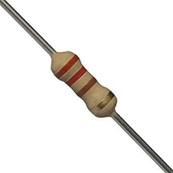
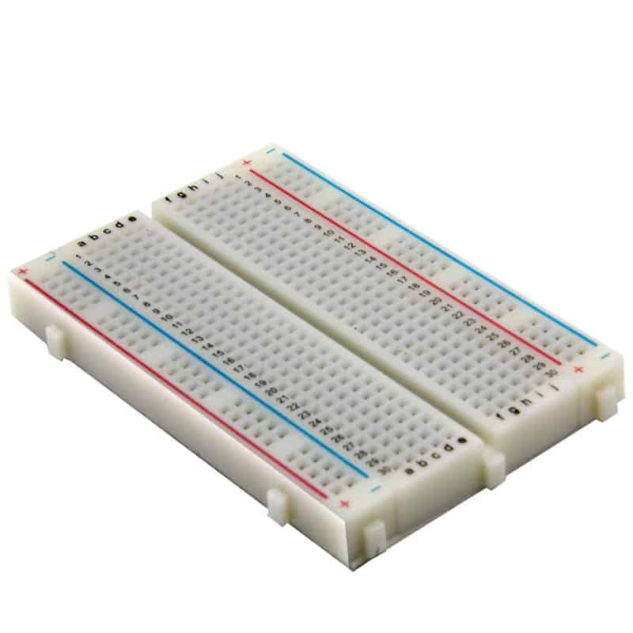
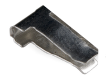
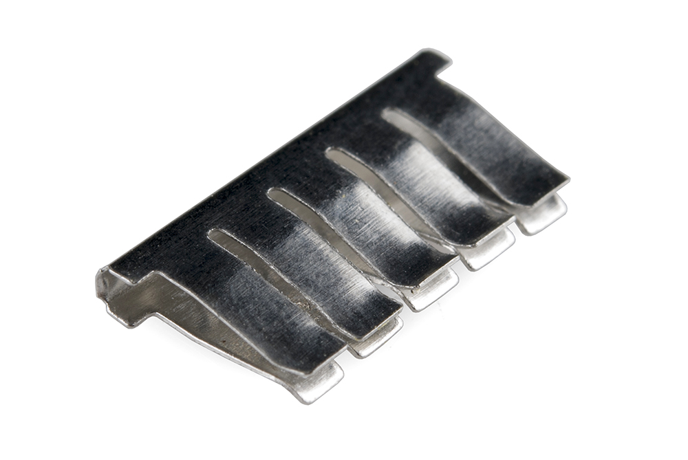
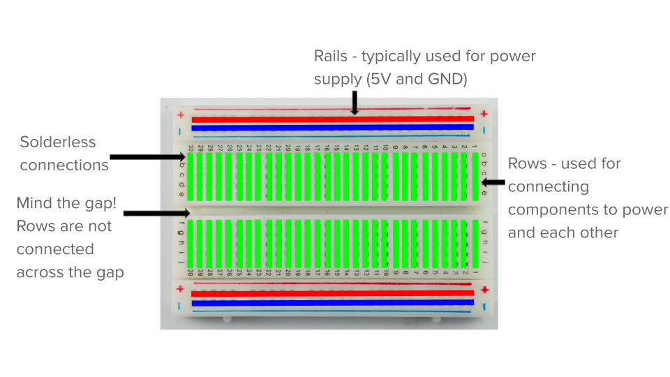
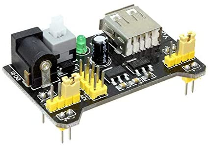
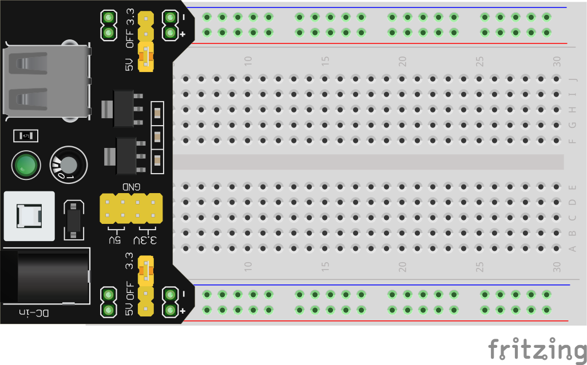
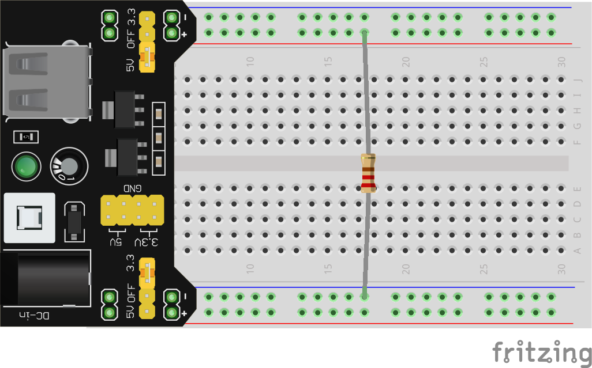
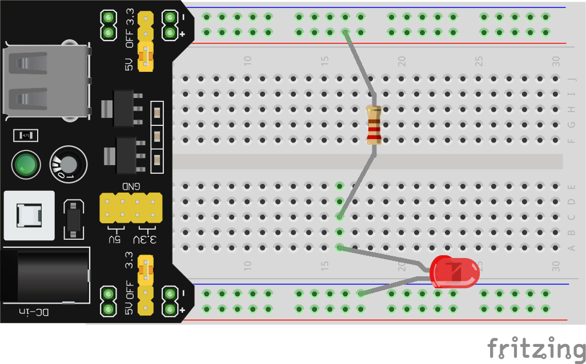

## Our First Circuit

When we provide a path for electrons from higher to lower voltage, we create a **circuit** (from the Latin _circuire_ meaning "go round"). If that path is just a wire like our examples above, we call it a **short circuit**, meaning there is nothing limiting the speed of the electrons and they will go as fast as physically possible. This can generate a lot of heat very quickly and can be dangerous, but will almost certainly damage to your equipment. **SO DON'T BUILD THIS CIRCUIT!** We'll get to our actual first circuit shortly, but first we need a way to draw circuits. 

### Schematic Diagrams
One way to represent a circuit is with a **schematic diagram**, here is the **schematic diagram** for our battery with its terminals connected:

![Short Circuit][shortcircuit]

Schematics show all of the **components** in a circuit and how they are connected. This part of the diagram is the **schematic symbol** for a battery:

![Battery Symbol][pssymbol]

Go ahead and copy that into the first row of the **Electrical Components Worksheet** under **Schematic Symbol**. Leave the rest of the row empty for now. 

The black lines forming the rest of the circuit in the diagram represent a **conductor**. This is often a wire, but could be any way that two component terminals are electrically connected. The shape of the connection doesn't matter, the **schematic diagram** is an abstract representation of the circuit and is organized for readability. All that matters is which terminals are connected to which other terminals.

Here is the schematic for the first circuit we will build:

![Simple Circuit][simplecircuit]

That new symbol on the right, labelled "**R1**", is a **resistor**. Resistors limit the speed of electrical current. More on them later, for now all you need to know is this is what they look like in your kit:

You have 5 different kinds of resistors in your kit, you can tell them apart by the colorful stripes. We'll go over how to read those stripes eventually, but right now just take my word for it that the one we need, 220Ω, matches the picture above: two **red** stripes and a **brown** stripe. (Careful not to confuse it with RED-RED-GREEN, which is **2.2 Million Ω!**)

### Breadboards

Now, we could build this circuit just by holding the resistor and a battery in our hands, but once we have even slightly more complicated circuits, this would get out of hand (nice). Instead we will be using the tried and tested method of electrical engineers everywhere: the **solderless breadboard** 

> Fun Fact: Breadboards get their name from long ago, when literal 'bread boards' were used. People would hammer some nails into a wooden cutting board and wrap the ends of wires or the legs of components around the nails to connect them together. Even though the modern breadboard is a much more elegant solution, there are enough similarities to the original design that the name stuck.

Breadboards provide a way to build electrical circuits in a rigid, but non-permanent way, so we can rearrange, redesign, experiment, and tinker to our hearts' content. Here's how they work:
* In each hole there's a metal 'clip'. When we put a wire, pin, or leg of a component into the hole, the clip holds it in place quite snuggly.
  

*  The wire (or pin or component leg) is also making electrical contact with the clips, which is important because the clips are not in isolation, they are actually part of a strip of clips.

* This means that rows of holes are electrically connected together, two wires each plugged into clips on the same strip are electrically connected

* So we just need to know how these 'clip-strips' are arranged inside the breadboard. The breadboard in your kit is a standard configuration:

There are 60 strips of 5-clip-strips (highlighted in **green**), I'll refer to them as **'rows'** and there are 30 of them on either side of the gap down the middle. Keep that gap in mind, for very important reasons that we will see later on the rows are **not** connected across the gap.

There are also 4 very long strips (highlighted **red** and **blue**) running along the long edges of the breadboard. we call these **'rails'** and typically connect them our positive(+) and negative(-) of our **power supply** because those usually have the most connections made to them, and it's handy to have easy access to (+) and (-) from any row.

> Using a breadboard can take some getting used to, it requires some fine-motor skills and good spatial awareness and problem solving. If it isn't 'clicking' right away, give it time. Trust the process and follow along as best you can. I'll be showing how to construct the first few circuits on the breadboard before you have to figure it out on your own. And if you are nervous about damaging components, or the fine-motor skills required are beyond your abilities, Autodesk has a great online breadboarding simulator built into [TinkerCAD](https://www.tinkercad.com/).

### ~~UN~~LIMITED POWER

Ok we have our **breadboard**, we have our **resistor**, we just need the **power supply**. There are lots of ways to get power to a breadboard, I think the solution included in your kit, though, is the perfect way to get started with building circuits. Find the thing in your kit that looks like this:

This handy circuit is an **MB102 Breadboard Power Supply** which fits perfectly over the first 5 rows of a standard breadboard and provides a nice, clean 5V or 3.3V to the **rails**. It can be powered by either the barrel jack or the USB port, we'll be using the USB cable provided in your kit to draw power from your computer. Before moving on, lets finish up the first row of your **Electronics Components Worksheet**.

We now know this type of **Component** is a **Power Supply**, and you should already have the **Schematic Symbol** drawn in from earlier. 

There important **Properties** to know about **power supplies**: What **voltage** they provide (measured in Volts (V) of course), and the **maximum amount of current** they can provide (we'll deal with the units for current later).

By now you should be able to write a brief **Description** of what a **power supply** does, in general.

And finally, as stated above, **In Your Kit** you have an **MB102**, which can supply either **5V or 3.3V**. To find the **maximum current** the MB102 can dish out we'll have to find something called a **Datasheet**. Lucky for you I've already done the searching, but if you ever need to find a datasheet, a quick Google search for **"mb102 datasheet"** will do the trick. [Here's a datasheet for your MB102](https://components101.com/sites/default/files/component_datasheet/MB102-Datasheet.pdf). A quick read of the first page tells us that the MB102 can safely provide up to **700mA** (more on mA later) of current. 

### Do you wanna build a circuit?

We're *finally* ready to build this circuit, thanks for hanging in there. Let's start by plugging the power supply into the breadboard. Here's what it should look like:

Make sure all 8 pins ended up in a hole on the breadboard, and to make things easier for you, make sure the pins labelled with a "+" are in the **red** rail, and the "-" pins are in the **blue** rails. Then go ahead and connect the MB102 to one of your computer's USB ports.

Whenever you are connecting or deconnecting components, you should **always** disconnect the breadboard from it's power source. Luckily the MB102 has a handy on-off switch (tall white button near the USB) so you don't need to unplug the USB all the time. Using that button, make sure the green LED is off (indicating the power supply is turned off) before moving on.

It's been a while since we saw that schematic, so here it is again:

![Simple Circuit][simplecircuit]

So we just need to connect one leg of the **resistor** to the positive side of our **power supply**, and the other leg to negative, it doesn't matter which leg goes where, resistors work the same in both directions. There's a few different ways to build this on the breadboard, here's one way:

You'll need to bend the ends of the legs 90°, and make sure they're pushed into the breadboard clips. With the circuit assembled, go ahead and turn on your power supply. If all went well, you should see...

**Absolutely nothing!**

I'm not sure what you were expecting, there isn't anything in this circuit that "*does*" anything, at least not visibly.  But just because you can't see it doesn't mean something isn't happening. Soon we'll be including LED lights into our circuits, which do give us nice visual clues about what's going on in our circuit, but it's important to keep in mind the fundamental truth: **if we give electrons a path, they will take it, even if there's nothing for us to see**.

## Lumos!

We could do a lot of learning with that basic little circuit, but that's boring so let's get this breadboard *lit*.

![A Simple LED Circuit][simpleLED]

You've probably figured out from the label what the new symbol in this schematic is: an **LED**, which stands for **Light Emitting Diode**. Diodes, in general, are electrical components that only allow current to flow through them in one direction, like a one-way street. **LEDs** are just a fancy version of a diode that happens to light up. This means that, unlike the **resistor**, it matters which legs of an **LED** you connect where. Your kit contains a few different colors, but all share the same basic shape:

**For this example and into the next lesson, please use a RED LED**

There are two ways to tell which leg is which. First, you'll notice that **one leg is slightly longer than the other**. This is the positive leg. The other way to tell is by looking closely at the bottom of the plastic cap of the LED. While it looks like a circle, **one side is actually flat**. The leg closest to this flat edge is the negative leg. **LEDs** only allow current to flow through them (and thus light up) from the positive leg to the negative. A backwards LED is the **#1 most common mistake you will make in this course**, luckily it's an easy fix. In the circuit we are building, you'll need to connect the **positive** leg to one of the **resistor's** legs, and the **negative** leg to the **negative rail**. Here's one way to build this circuit on the breadboard:

If you did everything correctly, your **LED** should illuminate when you turn on your power supply (**you did turn it off before changing up your circuit right?**). If not, check the following common issues:
1. Is your **power supply** plugged into the computer? Does it's green **LED** light up when you turn on the power supply?
2. Is your **power supply** installed in your breadboard correctly? See the image above for reference.
3. Is the **LED** backwards? The long leg should be connected to the resistor, the short leg (nearest the flat side) should be connected to **0V** via the **(-)** rail.
4. Are the **positive leg** of the **LED** and one leg of the **resistor** both in the same **row** on the breadboard?
5. Is the other leg of the **resistor** connected to **5V** via the **(+)** rail?

If you've double checked all of these possible issues and it still isn't working, **then** you may ask for help. Get used to troubleshooting on your own, most of the time when I build circuits I still make silly mistakes, that's just part of the game. Tracking down errors and figuring out how to fix them is a necessary skill in this field (and life, really). There's no shame in asking for help, but make sure you give it your best effort to figure it out on your own first. **It is in these moments that the most valuable learning occurs**.

## Next Steps
In the next lesson, we're going to examine this LED circuit in a bit more depth, learn how to measure **voltage** and **current**, and discover some fundamental relationships between them.

[shortcircuit]: ../images/schematics/circuit0b.svg
[pssymbol]: ../images/schematics/circuit0a.svg
[simplecircuit]: ../images/schematics/circuit1a-simple.svg
[bbp]: https://components101.com/sites/default/files/component_datasheet/MB102-Datasheet.pdf

[simpleLED]: ../images/schematics/circuit3-simpleled.svg