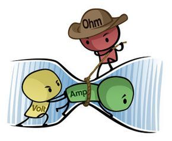

## Enter Multimeter
At the end of Lesson 2 we had constructed this simple LED circuit:

If the LED is on, that means we know for sure that there is not only a **voltage** present, but also that we've created a **closed loop**, so the electrons can flow (**current**) through the LED, which is what makes it light up. But in order to know much more about what is going on here, we're going to need a way to **measure** the **voltage** between various parts of our circuit, as well as the amount of **current** that is flowing.

That's where this beauty comes in:

This is a **multimeter**, so named because it's actually a collection of **multiple** different measuring tools. In this course we will mainly use our **multimeters** to measure **voltage** and **current**. It's handy to have this functionality in one tool, but there are subtle differences in **how** we use it in each case, so pay close attention.

## Measuring Voltage

Let's start with the easy one: **voltage**. The dial in the center of the **multimeter** selects the *mode*: what you are measuring. The **DC voltage** modes are in the top left corner of the dial, and you can see that there are a few options: 200mV, 2V, 20V, 200V, and 600V. You want to use the mode with the smallest number that is still higher than your supply voltage. In our case, working with a **5V** power supply, we want to always use the **20V** mode (right around 10 o'clock).

A good first step would be to verify that our supply voltage is in fact **5V**. Remember that **voltage** is the *difference* in electrical energy between two points. Our **supply voltage** is the difference between our (-) and (+) rails, so to measure **voltage** we need to connect one of the multimeters **probes** to the (+) rail, and the other to the (-) rail, like this:

That **(V)** symbol of course represents our multimeter (in **voltmeter** mode). There are some options when it comes to how to actually connect the probes to the rails but the easiest way makes use of any exposed conductors that are already connected to the rails. In our case, he leg of **R1** that is connected to the (+) rail is an easy place contact with one probe, and likewise with the leg of the **LED** going into (-). Make sure the circuit is turned on (your LED should be lit), and measure the **supply voltage** (also known as VSS or Vtot). **Record the result in your Workbook**

You should see a value *close* to 5V, though likely not exactly. This is something to get used to in the world of electronics: while we talk about electronics in **ideal** terms with nice round numbers, the reality is a lot messier. So any **supply voltage** between 4.9V and 5.1V is perfectly normal. Whenever asked to record a measurement, write down the actual measured value. We'll often compare it to a calculated value, just remember that **close is good enough**.

>You might get a reading of around **-5V**. All this means is you have the probes backwards: the **red** one should be used for the higher voltage point. Functionally it doesn't matter, you'll get the same number either way, just with a (-). In these cases, record the **actual** voltage **as if you had the probes the right way around**.

>If you aren't getting anything near **5V** or **-5V** on your multimeter, first make sure it's in the **20V** mode. Double check that you're circuit is turned on, and that you are contacting the probes to the right parts of the circuit. Our multimeters also have a **pause** function (called **hold**), which freezes the display. If there is a small **H** on your screen, press the **HOLD** button to unfreeze the display. If you've done your best to figure it our on your own and are still not getting a reading near **5V**, then ask for help.

Now for some more practice, **measure and record VR1**, the voltage *across* the resistor:

And **VLED**, the voltage *across* the LED:

You probably found VR1 to be something in the range of about **3V**, and VLED to be close to **2V**. We call these the **voltage drops** over these components, you can think of the **resistor** and **LED** as *"using up* the voltage provided by the **power supply**. Notice that VR1 and VLED add up to our Vtot of 5V? We'll discuss that phenomenon more deeply in a later lesson, for now let's look at measuring **current**.

## Measuring Current

**Current**, remember, is the amount of electrons (more specifically the amount of electrical charge) moving through a circuit per second and is measured in **Amps**. In order for our **multimeter** to be able to measure **current**, we need to insert the **multimeter** into the circuit to force the electrons to actually flow through the **multimeter**. When measuring **volts** the multimeter was a passive observer, just checking in at some points, while for **current** the multimeter is an active part of the circuit.

The *mode* we will use on our multimeters is **200mA** (top right on the dial, around 2 o'clock). Just like millilitres (1/1000th of a Litre) and millimeters (1/1000th of a meter), milliamps (mA) are 1/1000th of an Amp. **200mA** is the same as **0.2A** and is more than we will deal with in this course. Get used to measuring in **mA**, but converting to **A** for calculations.

> To convert from mA to A quickly, just move the decimal over 3 places to the left

When in **200mA** mode, the multimeter **acts just like a wire**, so it is **VERY IMPORTANT** that you don't attempt to measure a **voltage** when in **200mA** mode or you will create a **short circuit** and damage a small fuse in the multimeter, which then needs to be replaced. 

To measure **current**, you will need to *break* your circuit somewhere and reconnect it using the probes of the multimeter as if they were just ends of a wire. Here is the schematic diagram for measuring the **current** leaving the **power supply**:

The **(A)** symbol here represents our multimeter in **Amp** mode, notice how it is part of the same loop as R1 and the LED.

Whatever number of electrons that leave the **power supply** is always the same as the number that go back into the **power supply** at the end of the loop, so you can measure the current in the circuit at any point (before R1 as shown, between R1 and the LED, or after the LED). I'll leave it to you to figure out the best way to insert the multimeter into your circuit. You'll know you're using the multimeter correctly when your LED turns on and you get a reading of around **12-15mA** (0.012-0.015A). **Record your measurement in your Workbook**.

## Ohm's Law
It's a good thing there's less than 15mA coursing through your circuit too. [Take a look at the datasheet for this LED](../extras/datasheets/2.Red(Diffused)5mm%20.pdf). There's a lot of information in there, but the most important one is the **Max Continuous Forward Current** which is apparently **20mA**. This means the LED can only safely handle up to 20mA of current before burning up.

So how do we make sure we keep our **LEDs** safe and limit the amount of **current** passing through them? Well that's the **resistor**'s job in this circuit, when we use a restistor to protect an LED like this, we call it a **Current Limiting Resistor**. **Resistors** limit the speed of electrons: more resistance = slower current. In fact, the relationship between **voltage**, **current**, and **resistance** can be summed up with a simple mathematical formula:

> current = voltage / resistance
> **OR**
> I = V/R

This is known as **Ohm's Law**, you might have seen it before as **V=IR**, which is algebraically true, but is might lead you to believe that **voltage** depends on **current** and **resistance**, when really it is **current** that depends on **voltage** and **resistance**.

Let's use **Ohm's Law** to see if our measurements made sense. **Ohm's Law** tells us that the current through a resistor should equal the voltage across the resistor divided by its resistance. You measured about **3V** across a **220Ω** resistor so:

> I = V / R
> 
> I = 3V / 220Ω
> 
> I = 0.013636.....A
>
> I = ~0.014A
> 
> I = ~14mA

Use the actual voltage you measured for **VR1** in the above calculation, don't forget to convert your result to mA by moving the decimal **3** places to the **right**, and compare the result to what you measured for **Itot**. They should be pretty close if you've made your measurements correctly.

## Side Note on Resistors
If wires are like 4-lane highways, **resistors** are like winding, bumpy, dirt roads; electrons can still travel through them, but have to take their time. This might be a bit of a misleading analogy though, because the resistor not only affects the speed of electrons while they travel through it, but the speed of **all** electrons everywhere in the resistor's circuit. So to extend this analogy, electrons are always in a bumper-to-bumper traffic jam, they all move only as fast as the slowest ones.

Another way to think about resitors is imagining electrical current like water flowing from your sink down to the sewer line. If the pipe is clean, the water can flow as fast as possible (thanks gravity), but if there is a wad of cat hair stuck halfway down the pipe, not only will the water flow slowly through the hairball, but all of the water above the clog will also be moving slowly, and after the clog there will also only be a trickle entering the sewer.

So the current through a resistor is the same as the current going through the rest of the loop that contains the resistor. In the calculation above, we found the current through **R1**, but because of our traffic-jam analogy, that is also the amount of current flowing through the LED (and flowing out of the power supply, and back into the power supply for that matter).

## Dim the Lights
To explore this further, lets make one small change to our circuit and change **R1** from 220Ω to **470Ω**:

The color code for a 470Ω resistor is **YELLOW-PURPLE-BROWN** (more on resistor color codes later). Make the swap, and then **remeasure and record VR1 and Itot**. 

What you should find is that **VR1** stayed more or less **the same**, this is due to an interesting property of **LEDs** called their **forward voltage**: **LEDs**, when powered, will always "*consume*" roughly the same amount of voltage. Checking the [datasheet](../extras/datasheets/2.Red(Diffused)5mm%20.pdf) again, we can see the **forward voltage** of our LEDs is around **2V**. Since our **supply voltage** of **5V** hasn't changed, and the LED should always "*use up*" roughly **2V**, that leaves about **3V** to drop across the resistor, regarless of its resistance.

> You should now have enough information to fill out the LED row in your **Electronics Components Worksheet**. Your kit has both 5mm and 3mm LEDs in various colors. While they all have the same **maximum current**, certain colors have different **forward voltages**. It's up to you to check through the [datasheets](../extras/datasheets.md).

Meanwhile **Itot** should now be **decreased** to about **6mA**. If we check the math:

> I = V / R
> 
> I = 3V / 470Ω
> 
> I = 0.00638.....A
>
> I = ~0.006A
> 
> I = ~6mA

Again, use your actual measured value for **VR1** and verify this calculation with what you just measured for **Itot**.

You might also have noticed that the LED is slightly dimmer, this is because the brightness of an LED depends on the amount of current passing through it. So by reducing the resistance, we can get brighter light, but **be careful**: remember that our LEDs have a **maximum current** rating of 20mA, so there is some minimum amount of resistance that is safe to use in this circuit. Using you algebra skills you should be able to rearrange **Ohm's Law** to solve for R. If you don't know how, you'll have to take my word for it that if I=V/R, the R=V/I. In any **5V** simple LED circuit, we can assume a **3V** drop across our **resistor** (due to the **2V** forward voltage of our LEDs) so: 

> R = V / I
> 
> R = 3V / 0.02A (20mA)
> 
> R = 150Ω

So the smallest **current limiting resistor** we could use for our LEDs would be 150Ω, but 220Ω is pretty close so we'll use those as our standard **current limiting resistor** for the rest of the course.

As a final exercise, can you calculate what the current in this circuit would be if R1 was 10kΩ ("k" stands for "kilo" meaning thousand, so 10kΩ=10000Ω) and can you predict what would happen to the LED?

## fin
Whew, that was a big one, good work getting through it. We've got two more *heavy* topics to get through to understand a bit more how resistors work in **series** and **parallel**, and then things will start to speed up and involve way less talking, and a lot more doing.

