We're going to take a break from the **LEDs** for a bit, don't worry they'll be back soon. First, though, we need to take the time to define and understand two very important concepts: **series** and **parallel circuits**.

## Series Circuits

When we say things are **in series** in normal language, what we mean is that they come one after another. Likewise in electrical circuits, components **in series** are connected one after the other in a single, continuous path. We've already been working with series circuits, like our basic **LED** setup:

Here we would say the the **LED** and **resistor** are **in series** because they are part of the same loop connecting **5V** to **GND**. We noticed in [Lesson 3](./ELT1010GuideBook3.md) that the **voltage drops** across the **LED** and **resistor** (2V and 3V, respectively) always added up to 5V. This should make sense: the **LED** and **resistor** "_use up_" the voltage provided by the **power supply**, what does up must come down. This property of electricity is called **Kirchoff's Voltage Law** which is usually written like this:

> The algebraic sum of all voltages in a loop must equal zero

By algebraic, we mean that we account not only for the amount of voltage, but also the sign (positive/negative). **Power supplies** provide "positive voltage", while **voltage drops** are considered "negative voltage".

> VSS + VLED + VR1
>
> = 5V + (-2V) + (-3V)
>
> = 0V

In our LED circuit, because of the special nature of **LEDs** _using up_ a fixed voltage no matter what (AKA its **forward voltage**), the voltage drops were always the same, but what happens if instead we are just dealing with **resistors**? Does the voltage drop across each one in some consistent, predictable way as well?

To find out, lets start with this circuit:

Here we have 2 **220Ω resistors** in series. Remember the 200Ω resistors have the **RED-RED-BROWN** color code. The first thing I want you to do is measure Itot (the amount of **current** flowing through the loop). Remember to measure current:

- put the multimeter in **200mA** mode
- disconnect the circuit (between the two resistors is easiest)
- make sure you power supply is **on**
- pretending the two probes of the multimeter are just the two ends of a wire, use them to reconnect the circuit.

You should see something around **11mA**, record your measurement in your workbook.

### Same-Same But Different

Slight sidetrack, but it's worth quickly discussing that from the electrons' points of view, these two resistors just _feel_ like one big resistor. This is known as **equivalent resistance** which is _a single value of resistance that can replace any number of resistors in series without altering the values of the current or the voltage in the circuit_. To figure out the **equivalent resistor** for our 2 220Ω resistors, we can use **Ohm's Law** to figure it out. Rearranging for **R**, **Ohm's Law** tells us:

> R = V / I
>
> R = 5V / 11mA
>
> R = 5V / 0.011A
>
> R = 440Ω

What's interesting about this result is that 440Ω is _exactly_ 220Ω + 220Ω, in other words the **equivalent resistance** of two or more resistors in **series** is simply the sum of their individual resistances.

### Back on Track

Making sure to first switch your multimeter back into **20V** mode, **measure and record** the voltage drops VR1 and VR2, and then verify **Kirchoff's Voltage Law** by adding those two values together, **record** this result as well.

There are two things to note from this exercise. First, you should have found that VR1 + VR2 = ~5V. This should come as no suprise as that's literally the phenomenon we were just talking about. You will also notice that both VR1 and VR1 are pretty much identical, ~2.5V. This is probably not surprising as it follows from reason: the resistors are equally _difficult_ for the electrons to move through, so an equal amount of energy is lost in the process.

What do you think would happen to the **voltage drops** if R1 and R2 _weren't_ equal? Let's find out with a quick adjustment to our circuit:

First, as a follow up to our discussion on **equivalent resistance**, let's work backwards and see if we can _predict_ the current in this circuit (Itot). First let's calculate the **equivalent resistor** to our 220Ω and 470Ω series resistors:

> Rtot = R1 + R2
>
> Rtot = 220Ω + 1000Ω
>
> Rtot = 1220Ω

**Record this in your workbook**. Using this result along with our known VSS of **5V**, we can rearrange **Ohm's Law** to solve for **I**:

> I = V / R
>
> I = 5V / 1220Ω
>
> I = 0.004098...A
>
> I = ~0.004A
>
> I = ~4mA

**Record this in your workbook**, and go ahead and measure and **record** Itot and see how close our prediction of 4mA is. It likely won't be exactly correct, remember that _close enough_ is what we're all about in electronics. A small discrepency is due to a few factors:

- we rounded the result of our calculation
- resistors are not exactly their _official_ resistance, plus or minus 15% is normal
- your **power supply** isn't providing exactly **5V**

As long as your measurement was close, you're probably on the right track.

Now back to **Kirchoff's Voltage Law**. Again measure and **record** VR1 and VR2 and calculate and **record** VR1+VR2. Hopefully your measurements added up to **5V** once again (try again or ask a friend for help if not), but this time the individual **voltage drops** were different.

You should have found that VR2 was quite a bit more than VR1, does that agree with what you assumed would happen? This tells us that when resistors are in **series**, the amount of voltage each one "_uses up_" is proportional to their resistance, compared to the other resistors. Put simply: bigger resistors _hog_ more of the available voltage.

Looking even closer, you might notice that VR2 is **almost exactly 4 times bigger than** VR1, just as R2 (1000Ω) is just a bit more than 4 times bigger than R1 (220Ω). This is no coincidence (which are very rare in this field). **The distribution of voltage drops across resistors in series is _exactly_ proportional to their relative resistances**.

This is some heavy stuff to ponder, so we'll leave it at that for today. Next time we look at **parallel circuits** and the interesting way they _mirror_ and _invert_ many of the concepts we've studied so far.

[PREVIOUS LESSON](./ELT1010GuideBook3.md) -- [NEXT LESSON](./ELT1010GuideBook5.md)
