## Parallel Circuits
Last time we looked at what happens to **voltage** and **current** when we have resistors in **series**, which means one after the other in the same loop or path. If instead we have resistors forming separate paths or loops, we say they are in **parallel**.

Here is an example of a **parallel** circuit:

Notice that the **5V** line coming out of the power supply *splits* into two branches, which then join back up at **GND**. **Parallel** branches give the electrons more than one possible routes to take, but regardless of their choice, they still have to "*lose*" the **5V** they gained from the **power supply** before returning to the negative terminal. So each branch is functionally the same as our simple LED circuit from [Lesson 2](./ELT1010GuideBook2.md), you can think of the above circuit like this, but with the two circuits *sharing* the **power supply**:

Go ahead and build the parallel circuit, **PLEASE USE IDENTICAL RED (or yellow) LEDs FOR THIS EXERCISE**. One way to construct it on the breadboard is like this (though as always, there are many ways to accomplish this):

We're going to take a look at what happens to **current** when we give electrons multiple paths like this. Let's start by using **Ohm's Law** to predict the **current** through each branch, and then measure to verify.

The current **I1** is the current through the first branch. Remembering what we know about components in **series**, this is the same this as the **current** through just the resistor **R1**. So if we know **VR1** (the voltage drop across R1), we can us **Ohm's Law** to calculate **IR1**, which is the same this as I1.

**Measure and record VR1.** You should get around 3V.

**Using your measured VR1, calculate and record I1** using Ohm's Law:

> I = V / R
> I1 = VR1 / R1
> 
> I1 = ~3V / 220Ω
> 
> I1 = ~0.0136A
> 
> I1 = ~14mA

 Just as before, our **220Ω** resistor limits the current to the LED to about **14mA**.

Verify this result by **measuring and recording I1** in the same way we've done in previous lessons. When you break the connection between **R1** and **LED1** to do this, causing **LED1** to turn off until you reconnect it to **R1** with the detour through the multimeter, you should notice that **LED2** stays lit the whole time. This is because we haven't interrupted the path there. Hopefully your measurement is close enough to your calculated prediction.

Repeat the above process for the 2nd branch, **measure and record VR2** and then use Ohm's Law to **calculate and record I2.**

>NOTE: Older versions of the workbook contain some typos, including the labels in the 2nd row of boxes for this exercise. They should read: "VR2", "I2 (calc.)", and "I2 (meas.)"

Once you measured **VR2** and found it basically the same as **VR1** (I hope, otherwise maybe go back a few lessons), you could probably guess what **I2** was going to be: again around **14mA**. Remember, the electrons **have** to "*use up*" the **5V** no matter which path they take, so if the **voltage drop** is going to be the same, and the components they are passing through are identical, there shouldn't be any difference in how fast they flow.

But what does this mean for the current *before* and *after* the fork in the road? In other words, but much **current** in total is flowing **out of** and back **into** the power supply, labelled **Itot** in our schematic?

## Kirchoff's Current Law
To measure **Itot**, we'll need to get a bit fancy. Remember that to measure **current** we need to *break* the circuit, and then reconnect it with a **detour** through the multimeter. This was easy in the branches, the connection we broke involve two long exposed conductors to touch the probes to. Since the probes don't fit in the breadboard holes, we can't take the exact same approach. 

Here's one way to measure **Itot**, but as usual there are many other creative ways you might come up with. Just make sure that this time, when you *break* the circuit, both **LEDs** turn off, since we are dealing with the **source** of both branches (imaging damming a river before a split into two streams).

In this image, the small **blue** wire is exactly that, just a small piece of wire with one end stuck in the **5V** rail, and the other end loose and exposed. Your kit comes with a set of **preformed breadboarding wire** in various lengths. We'll use these a lot more later on to make connections between breadboard rows when things get more complicated, but this is another handy application.

I've also moved the first leg of **both resistors** to a random row, they need to be in the **same row** for this to work. 

Now when I hold the black probe to the loose end of the little blue wire, and the red probe to one of the **resistors'** legs (doesn't matter which one, **if they're in the same row they are effectively just the same piece of wire**), both LEDs should turn on and you can read the **current** on the screen (assuming you're in **200mA** mode). **Record your measurement for Itot**.

You should find that the total **current** that this circuit *pulls* from the power supply is something around **28mA**. Compare this to the current you measured in each branch, **what relationship do you notice?**

It shouldn't be hard to see that the **total current** is simply the **sum** of the **current in each branch**. This phenomenom is known as **Kirchoff's Current Law** (busy guy) which states: 

> The sum of all currents flowing into a node **equals** the sum of all currents flowing out of the node

**Node** here is just a fancy word for junction, split, or fork in the road. It follows then from **Kirchoff's Current Law** that the current flowing back into the power supply, after the two branches have joined up again, should also be about **28mA**. You can test that for yourself if you like.

## The Road Less Travelled

Just like last time, our first example involved identical components, so once again let's see what happens when we make a small change to our circuit:

Again we are using the **470Ω** resistor, which has the **YELLOW-PURLPE_BROWN** color code.

If you have very keen eyes, you might notice a slight difference in the brightness of the two **LEDs**. As we discussed in [Lesson 3](./ELT1010GuideBook3.md), bigger resistors mean less current, which means dimmer LED.

**Perform all of the same measurements and calculations as we did earlier and record your findings**. In addition, see if you can predict **Itot** in this circuit once you know the current in each branch using **Kirchoff's Current Law**.

Things to notice here:
   
   1. **I2** should be around **6 or 7mA**. This should make sense, there's a bigger resistor which means less current.
   2. **I1**, meanwhile, stayed the same (**14mA**). Changing the other branch doesn't affect this branch. Remember, all that matters for current is a) how much energy the electrons have to lose (**V**) and b) how difficult the path is (**R**). Changing the resistor in the other branch doesn't change the fact that **electrons going through the first branch still have to lose 5V while going through the same resistor and LED combo**. 
   3. Once again the total current (**Itot**) should be **I1 + I2**. This time this is something close to **20mA (14mA + 6mA)**.

[PREVIOUS LESSON](./ELT1010GuideBook4.md) -- [NEXT LESSON](./ELT1010GuideBook6.md)