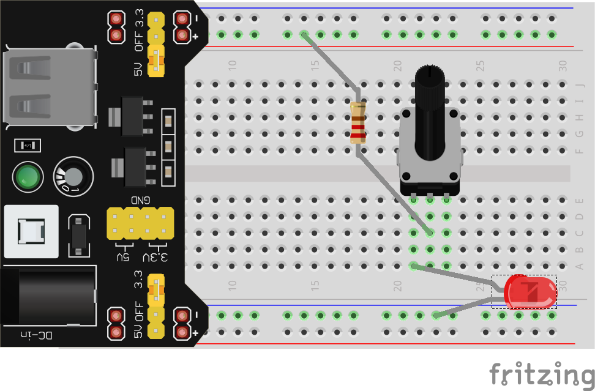

Up until now, we've worked with a limited pallete of components, just **LEDs** and **Resistors**. Today we will expand our repertoire with 2 (ish) new parts.

## Potentiometers
We've seen that by changing the **resistance** in a circuit, we can control the **current**, but to do that we've had to physically swap resistors in and out. If only there was some kind of resistor that could *vary* its resistance... some kind of **variable resistor**...

Well there are, and we do in fact call them **variable resistors**. One common **variable resistor** that you have in your kit is called a **potentiometer**, which looks like this:

More specifically this is a **rotary potentiometer** because it allows you to adjust resistance by *rotating* the knob. The obvious application of a variable resistor is to control the brightness of an **LED**, so lets do just that:

In this schematic you can see our old friend the **220Ω resistor** and an **LED**, but inbetween is something new labelled R2. This is the schematic symbol for a **potentiometer**, notice that it looks similar to the **resistor** symbol, but with an extra line coming out of the middle. I've labelled the connection points for you (1, 2, and 3), which correspond with the little "legs" sticking out of the bottom of your **potentiometers**, these are called **pins**. Pin **2** (pointing into the middle with an arrow) is the middle pin on your actual pots, and it doesn't matter which ones you use as pins **1** and **3**, so long as they are the **outside** ones.

To construct this circuit, you need to make sure each pin is **in its own row**, this is a rule of breadboarding in general: **no two pins or legs of a single component go in the same row**. Here's an example of how you could make this on the breadboard:

If you did this correctly, you should be able to dim or brighten the LED by turning the knob. 

See what the effect of using pin **3** instead of pin **1** is. 

Have you wondered why I bothered to include the regular **220Ω** resistor? To understand, lets see what's inside these little devices. If you were to take one apart (please don't), you'd see something like this:

The pins on the left and right (labelled **1** and **3**) are connected together with a long strip of resistive material which in our case has a total resistance of **250kΩ** (250000Ω). So pins **1** and **3** act just like the legs of a 250kΩ resistor, nothing fancy there. Where things actually get interesting is with pin **2**, which is connected to something called the "**wiper**". The wiper is a piece of conductive material that is attached to the knob on one end, while the other end rests on the resistive strip, making electrical contact. When the knob is turned, the end of the wiper *wipes* across the resistive material while maintaining electrical contact. 

Because of this design electrons could, for example, flow into pin **1**, through a portion of the resistive strip, into the **wiper**, and out pin **2**. So pins **1** and **2** act just like a resistor as well, but this time the resistance can change:

* If the knob is in the middle, the electrons would only have to go through half of the resistive strip, so between pins **1** and **2** is a **125kΩ** resistor (250kΩ / 2)
* If the knob is turned all the way **left**, the wiper would be basically connected directly to pin **1**, so between pins **1** and **2** is a **0Ω** resistor (AKA justa wire)
* If the knob is turned all the way **right**, the wiper would be all the way at the end of the resistive strip, so between pins **1** and **2** is a **250kΩ** resistor

And of course the knob could be anywhere inbetween these locations, so any resistance between **0Ω** and **250kΩ** is possible.

So why the **220Ω** resistor? Well we just saw that it's possible for the potentiometer to all the way down to **0Ω** if we turn it all the way down. We found in a previous lesson that in order to limit the current to our **LEDs** to no more than **20mA**, we need **at least** a **150Ωcurrent limiting resistor**. So we include the **220Ω** resistor as a backup, even if we turn the potentiometer down to 0Ω, there's still **220Ω** keeping our LED safe.

## Switches
Another obvious electrical component that you use every day is the **switch**. Essentially, a **switch** is any device that lets us connect and disconnect a circuit without removing any wires or components. 

### Slide Switches
You have two kinds of switches in your kit, the first one looks like this:

This is called a **slide switch** and are very common for on/off switches. Yours has two pins on the bottom and they work very simply: **the pins are only electrically connected if the handle is in the right place**.

This schematic uses the slide switch as an on/off switch for the whole circuit:

Try to build this on the breadboard yourself, remember that each pin should go in it's own row and use your **preform breadboard wire** as needed. **These pins are a little larger, you may need to use some force to seat the switch in the breadboard**

### Pushbuttons
The other switch in your kit is called a **pushbutton** switch or a **tactile** switch, often just called a **tac-switch**. You likely use these many times per day. The physical buttons on your phone, the keys of your keyboard, and any other button that has that satisfying, *tactile* "click" when you press it is likely just a **tac-switch** with a fancy plastic cap on it.

The easiest way to use these in a breadboard is to place them *across the gap*, to ensure each pin is in it's own row, like this:

To use it effectively, you need to understand what's going inside. Here's a diagram of the interal connections:

Notice that the pins **across** from each other are connected together. They are always connected together, no matter what. When we push the button, however, the two pairs of pins get connected together. So to use is in a circuit, you have two options of which pins to use: pins that are **diagonal** from each other or pins that are **side-by-side**. 

With this knowledge, you should be able to make this circuit using a tac switch to turn on and off just one of the LEDs:

This kind of **tac-switche** is called **Off - Momentary ON**, which just means the connection they form when you push the button only stays connected as long as you are holding the button down.

The world of switches is vast and full of technical terms, definitions, special applications, specific schematic symbols, and a wide array of aethetic choices. Just try to comprehend the amount of [different switches our supplier **DigiKey** stocks](https://www.digikey.ca/en/products/category/switches/15). But at the end of the day, they all boil down to the simple function of breaking and connecting one or more wires. 

[PREVIOUS LESSON](./ELT1010GuideBook5.md) -- [NEXT LESSON](./ELT1010GuideBook7.md)