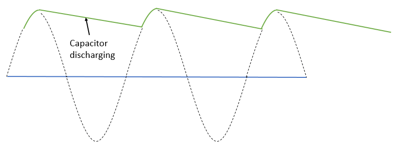

## Capacitors

We've come to the last of the so-called "**passive**" components of your kit. **Passives** are just components that don't **generate** energy, just **dissipate**, as in resistors, **redirect**, as in switches, or **store** it, which we'll see today.

In your kit you have 3 different components similar to those in this image:

These are all variations of the same thing: a **capacitor**. The cylinder-shaped ones are called **electrolytic capacitors**, which are **polarized** meaning just like **LEDs** they have specific **positive** and **negative** legs. The small blobby looking on is called a **ceramic capacitor** and is **non-polarized**, just like a resistor.

In simple terms, **capacitors** simply *store* energy when they experience a voltage between them. Think of it like a *very* small rechargable battery: if we apply voltage across, it will *charge* up. Then if we remove the voltage, it will act like a very small **power supply**, and *discharge* its stored energy, causing a short burst of current if a closed loop exists.

The amount of energy a **capacitor** can store, called its **capacitance**, is measured in **Farads (F)**. **1 Farad** is the amount of energy required to produce **1 Amp** for **1 second** at **1 Volt**.

    1F = 1A•s @ 1V

In practice, **1 Farad** is actually quite a bit of **capacitance** and a **1F capacitor** would be about as big as a hockey puck. We typically deal with **µF**, **µ** stands for **micro**, which means **one millionth**: **1µF = 0.000001F**. The ones in your kit are **100µF** (the black **electrolytic**), **10µF** (the yellow **electrolytic**), and **0.1µF (AKA 100nF or nano-Farad)** (the yellow **ceramic**).

## Capacitors in Action

To get a better sense of what **capacitors** are capable of, let's build this circuit, using a **tac-switch** for S1:

You'll notice the symbol for a **capacitor** labelled **C1**. The *curved* line indicates the **negative** side of the capacitor if it's **polarized**, which your **100µF capacitor** happens to be. Just like an **LED**, the **long** leg is the **positive**. Another way to tell is by finding the **stripe** or **arrows** on the side of the cylinder, the leg closes to that side is the **negative**.

Take care to follow the schematic **exactly**:
    
* 5V is connected **only** to on side of the **switch**
* The other side of the **switch** goes to both:
  * One leg of the **resistor**
  * The **positive** (long) leg of the **capacitor**
* The **negative** leg of the **capacitor** goes to **ground** (0V)
* The other leg of the **resistor** connects to the **positive** leg of the **LED**
* The negative leg of the **LED** goes to ground

        Looking at a whole schematic and just jumping in can often lead to errors. Instead, try to slow down and focus in on just one connection at a time. When we get to more complex circuits in the next module, this kind of patient, careful approach will be a necessity.

You'll know it's working when the **tac switch** works just like in the previous lesson to turn on the **LED** when pressed, but when you release it rather than turning off immediately, the LED **fades** out gradually. You can disconnect the capacitor to see the difference. Here's the step-by-step of what's happening:

1. You press the button which not only allows **current** to flow through the **resistor** and **LED**, but also exposes the **capacitor** to the **5V**.
2. While you hold down the button, the capacitor **charges up**, storing energy until it has **100µF** at **5V** stored. This doesn't take very long.
3. When you release the button, the **resistor** and **LED** are no longer connected to the **power supply**, imagine that whole left half of the schematic doesn't exist
4. However, the **resistor** and **LED** *do* form a path from the **positive** to the **negative** of the capacitor still, which right now looks just like a **5V**, so the **LED** stays on.
5. The **capacitor** runs out of stored energy pretty quickly, so the voltage it "supplies" rapidly decreases from **5V** down to **0V**
6. As the **voltage** decreases, the **current** through the **LED** decreases, causing it to fade out

## Other Applications

**Capacitors** have a wide range of uses other than just fading out LEDs. Try holding down the button and then release but immediately click it again. Depending on how fast you were you might have seen a slight fade, but try again but this time with the **capacitor** disconnected. Without the **capacitor**, not matter how fast your clicker finger is, the light **always** completely shuts off for a moment. With the **capacitor** there is enough power to keep the **LED** on until the main supply returns.

This concept is extremely handy when you have sensitive circuitry that would fail if the **power supply** voltage dipped temporary for some reason. It is very common to see a large **capacitor** connected to **5V** and **ground** to *smooth* out any flickers or variation in a supply **voltage**.

Another common application of **capacitors** is in the conversion of **alternating current (AC)** to **direct current (DC)**. The power lines to your house and into your wall outlets is **AC**, the graph of the voltage looks like a sine wave. Your electronics need **DC** to run, which is what we've been using in this class. After stepping the high **voltage** down to reasonable levels like **5V**, **AC-DC converters** like your cell phone charger use capacitors to *smooth* the sine-wave out into a steady **DC** signal. 

That's an overly simplified explanation, there's a lot more that goes into designing a safe **AC-DC converter** so please don't try to make one yourself.

## Next Time
One last component to go in this unit: the building block of all computers, **transistors**. Stay tuned..

[PREVIOUS LESSON](./ELT1010GuideBook6.md)