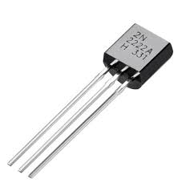
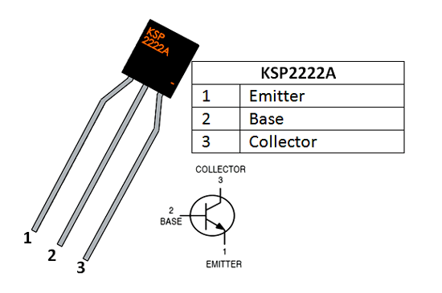
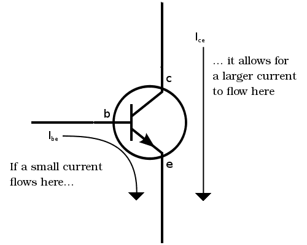
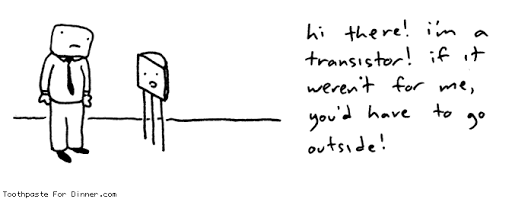

We've made it to the end of the components for this first unit, the rest will be covered in the second module when we explore Digital Logic Systems, but to get there we need to understand one of the most important electrical innovations of the modern age: the **transistor**.

Pictured here is a **2222A Transistor**, one of the most common **transistors** for our scale of electronics and the kind that is in your kit. Specifically, the **2222A** is an **NPN BJT** transistor, but don't worry about what those mean for this course. It might not look like much, but **transistors** are the fundamental building blocks of all computing: from the simple logic systems we will build in the next unit with just a few **transistors** to the **billions** of transistors that make up a modern CPU.

> My AMD 2200G processor is made of just under **5 billion (5,000,000,000)** transistors

## What's the Big Deal?
**Transistors** are actually pretty simple to understand, which is why it's so amazing to consider the scale and complexity of the computer systems build out of them. 

**A transistor is just a switch.**

Just like the **slide switches** and **tac-switches** in the previous lesson, **transistors** allow or block current depending on some input. In our physical switches, that input was **mechanical**: a human hand physically pressing and releasing the button for example. In **transistors** the input is **electrical**. **BJTs (bipolar junction transistors)** have 3 pins: **Emitter** (e), **Base** (b), and **Collector** (c). Here you can see the pinout of the 2222A, as well as the **schematic symbol** for an **NPN transistor**.

Think of the **collector** and **emitter** like either side of a switch: current can only flow from one to the other if a certain condition is met. An **NPN transistor**, like our 2222A, is turned "on" if there is a small amount of **voltage** between the **emitter** and the **base** (**Veb**) which causes a small amount of **current** to flow into the **base**.

To find out what voltage is needed between the **emitter** and **base** to activate our **2222A transistors**, let's build this circuit, taking care to reference the pinout above to make sure your transistor isn't backwards:

****Older versions of the workbook may have a slightly different schematic for this lesson, with the 220Ω resistor and the LED after the transistor. Either circuit will work to illustrate the concepts, but this one might be slightly more clear.**

What we have here is our standard LED setup with a **220Ω** resistor, but rather than going straight to **0v**, the LED instead connects to the **collector** of the transistor, which then has its **emitter** connected to **0V**. From what we discussed above, the LED will only turn on if the **transistor** is activated. 

The **base** of the **transistor** is connected to **pin 2** of a potentiometer, with **pins 1 and 3** of the pot connected to **5V** and **0V**. Used in this way, the potentiometer lets us set **pin 2** to any voltage between **0V** and **5V**, thus controlling the voltage between the **emitter** and the **base** of the transistor. The **10kΩ** resisitor (BROWN-BLACK-RED) simply limits the flow of current into the **base**. Transistors are quite sensitive, too much current in the **base** will cause them to break.

Double check your connections first, then power on your circuit and test it out. You should find that the LED goes from off to on within a small range of positions on the potentiometer, and while you can keep turning the knob quite a bit more, the LED doesn't continue getting any brighter.

With the LED **off**, **measure Veb**. Then turn the knob until the LED just starts to turn on and **measure Veb** again. Turn the knob again until the LED reaches its full brightness and **measure again**. Finally, turn the knob all the way up, even though the LED won't be getting any brighter, and **measure once more**.

You should have found that once you pass the point where the LED starts turning on, **Veb** stays fixed at around **0.7V**. This is very similar to the behaviour we've seen in LEDs and again here we call it the **forward voltage** of the transistor. This is the amount of voltage needed at the **base** to *activate* the transistor and let current from the **collector** to the **emitter**.

[PREVIOUS LESSON](./ELT1010GuideBook7.md)
