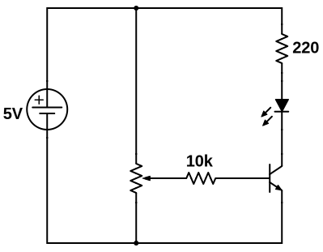

# ELT1010 Circuits Workbook

## Lesson 2

  
 
 
 
 
 
 

::: break
:::

## Lesson 3

<table>
<tr>
    <th>Vtot</th>
    <th></th>
</tr>
</table>

<table>
<tr>
    <th>VR1</th>
    <th></th>
</tr>
</table>

<table>
<tr>
    <th>VLED</th>
    <th></th>
</tr>
</table>

What is the relationship between VR1, VLED, and Vtot?

<table>
<tr>
    <th>Itot</th>
    <th></th>
</tr>
</table>

<table>
<tr>
    <th>VR1</th>
    <th></th>
    <th>Itot</th>
    <th></th>
</tr>
</table>

>Ohm's Law: I=V/R

What current would we expect if R1 was 10kΩ?

::: break
:::

## Lesson 4

<table>
<tr>
    <th>Itot (meas.)</th>
    <th></th>
    <th>Rtot (calc.)</th>
    <th></th>
</tr>
</table>
<table>
<tr>
    <th>VR1 (meas.)</th>
    <th></th>
    <th>VR2 (meas.)</th>
    <th></th>
    <th>VR1+VR2</th>
    <th></th>
</tr>
</table>

<table>
<tr>
    <th>Rtot (calc.)</th>
    <th></th>
    <th>Itot (calc.)</th>
    <th></th>
    <th>Itot (meas.)</th>
    <th></th>
</tr>
</table>
<table>
<tr>
    <th>VR1 (meas.)</th>
    <th></th>
    <th>VR2 (meas.)</th>
    <th></th>
    <th>VR1+VR2</th>
    <th></th>
</tr>
</table>

::: break
:::

## Lesson 5

<table>
<tr>
    <th>VR1 (meas.)</th>
    <th></th>
    <th>I1 (calc.)</th>
    <th></th>
    <th>I1 (meas.)</th>
    <th></th>
       
</tr>
</table>
<table>
<tr>
    <th>VR1 (meas.)</th>
    <th></th>
    <th>I1 (calc.)</th>
    <th></th>
    <th>I1 (meas.)</th>
    <th></th>   
</tr>
</table>
<table>
<tr>
    <th>Itot (meas.)</th>
    <th></th>    
</tr>
</table>

What is the relationship between I1, I2, and Itot?

<table>
<tr>
    <th>VR1 (meas.)</th>
    <th></th>
    <th>I1 (calc.)</th>
    <th></th>
    <th>I1 (meas.)</th>
    <th></th>
    
</tr>
</table>
<table>
<tr>
    <th>VR1 (meas.)</th>
    <th></th>
    <th>I1 (calc.)</th>
    <th></th>
    <th>I1 (meas.)</th>
    <th></th>
      
</tr>
</table>
<table>
<tr>
    <th>Itot (calc.)</th>
    <th></th>    
    <th>Itot (meas.)</th>
    <th></th>    
</tr>
</table>

::: break
:::

## Lesson 6

## Lesson 7

::: break
:::

## Lesson 8

## Lesson 9

<table>
<tr>
    <th>Veb to activate (meas.)</th>
    <th></th>
     
</tr>
</table>
