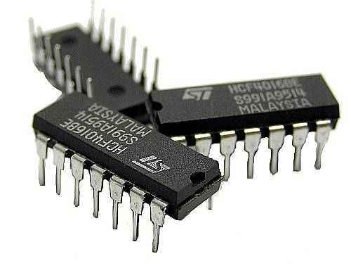
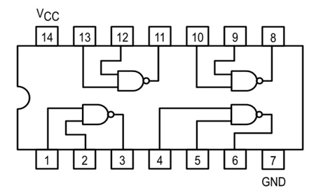
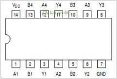
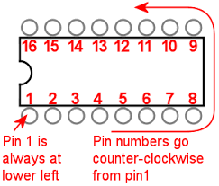
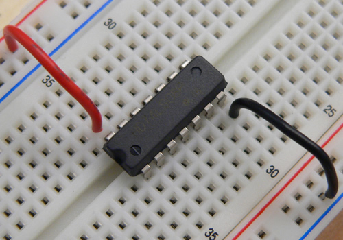
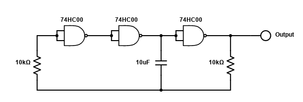
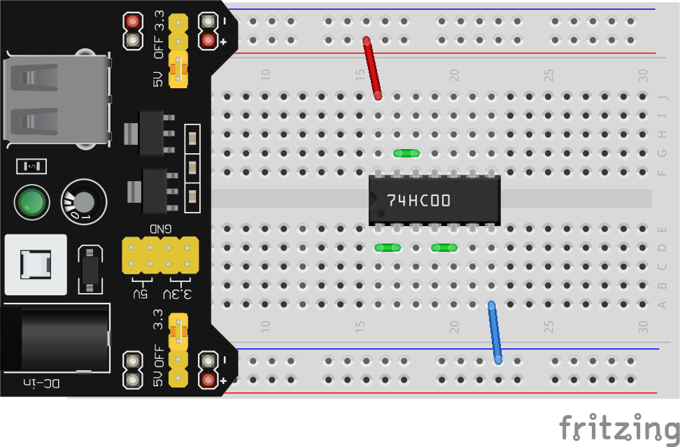
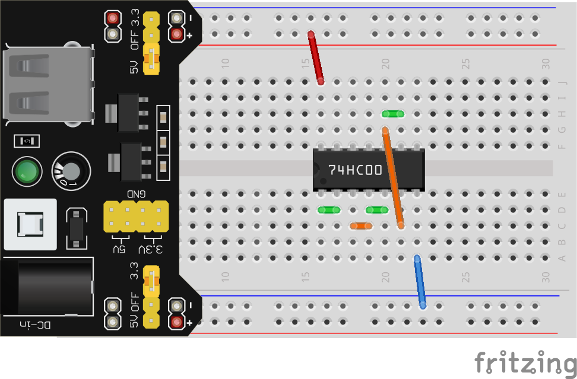
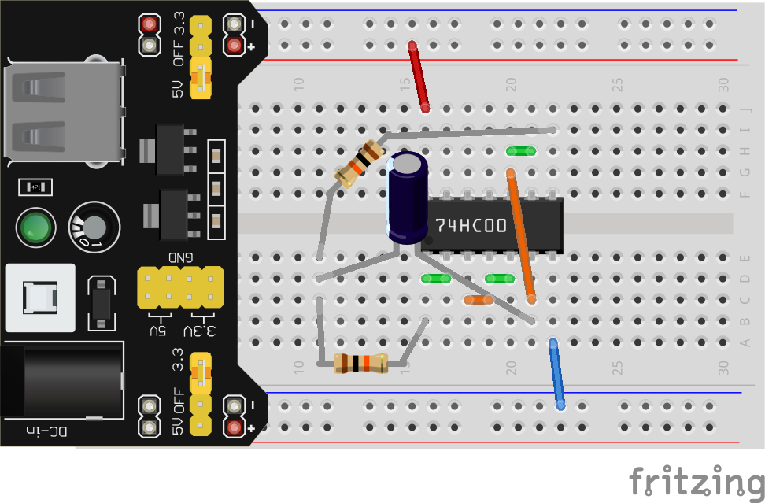
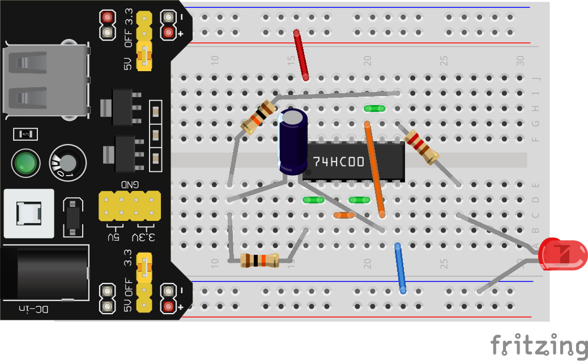

Welcome to a brand new module: NET 1010 Digital Logic Systems 1. In this module we will use our knowledge of basic electrical circuits from ELT 1010 to build and experiment circuits that perform **digital logic**. The logical first step, then, is to figure out what **digital logic** even means.

Rather than reinvent the wheel, I'll let Carrie Anne from [Crash Course](https://www.youtube.com/channel/UCX6b17PVsYBQ0ip5gyeme-Q) explain the fundamental concepts. Make sure to follow along on the first page of your [Digital Logic Workbook](../extras/LogicGatesICsWorkbook.pdf).

<iframe width="560" height="315" src="https://www.youtube.com/embed/gI-qXk7XojA" frameborder="0" allow="accelerometer; autoplay; clipboard-write; encrypted-media; gyroscope; picture-in-picture" allowfullscreen></iframe>

## ICs
As explained in the video, it's fairly easy to construct logic gates from just a few transistors, but in practice we rarely do so. Instead we use something called an **IC**, which stands for **integrated circuit**. Imagine designing a circuit, making it as small as you can, stuffing it into a small plastic box with only some wires sticking out for power, inputs, and outputs, and then mass producing them. That's an **IC**. 

There are thousands of different kinds of **ICs** all with different functions, not just logic gates. **ICs** also come in a variety of shapes and sizes (AKA **form-factors**), the **ICs** included in your kit are all **Dual-Inline Pin (DIP)**, which is specifically designed for the standard breadboard hole pattern.

To start with, we will make a few circuits using just the **74HC00 IC** from your kit, but we'll see the other **ICs** in action later. The **7400** is a **"quad NAND gate IC**, which means that it contains 4 individual NAND gates. Here is an **internal logic diagram** that might shed some more light on what this means:

Another common way of communicating how an IC works is a **pinout diagram** which just gives each pin a label. Here's the **pinout** for the **7400**:

In this case, **A** and **B** are used to indicate inputs to the NAND gates, **Y** is used for the outputs. **Vcc** and **GND** are standard labels for **positive** and **negative** voltage (**5V** and **0V** in our case). All of this information can be found on the [datasheet](../extras/datasheets/7400quadNAND.pdf), along with a billion more pieces of information that you'll likely never need. You can find the datasheets for any of the **ICs** used in this course by **Googling** or on the [datasheets page](../extras/datasheets.md) of this site. 

In any **IC** diagram you are looking from the top-down and both the diagrams and the **IC** itself will have some feature to know which end is which, either a small circle or an indent on one of the short sides. Pin numbering always starts with **1** and the bottom left (with the dot or indent on the left), and then counting up as you move **counter-clockwise** around the chip.

Armed with all this knowledge, let's first verify that our **74HC00** does in fact contain NAND gates. Plug your **74HC00** into your breadboard, spanning the gap. You might need to bend one row of pins slightly inward to get it to fit the first time. Using the diagrams above, connect the **Vcc** pin to **5V** and the **GND** pin to **0V**. **ALWAYS HAVE YOUR BREADBOARD POWER OFF WHEN CHANGING IC CONNECTIONS.**

Now choose one of the 4 NAND gates available and connect the output pin to an **LED + current-limiting-resistor** combo. This will serve as an indication of whether the output is on or off. Finally, connect the two input pins to **0V** with a wire to set them initially to **off** AKA **false**. Looking at the **NAND truth table** you completed from the video earlier, we expect the output should be on when both inputs are off. Turn on your power to verify, then verify for the other three combinations of inputs from the truth table. If your results don't agree with the truth table for NAND, check the following:
* Are you using the right IC? Look for the text "74HC00"
* Are you using the right pins? Double check the diagrams above
* Is your IC connected to power and ground?
* Is your indicator LED the right way around, and connected from the output pin to 0V along with a resistor?
* Do you have any idea what is going on? Ask for help if not

## Enough Talk, Time to Make Cool Stuff
Let's actually put these NAND gates to use. Here is the schematic for an *oscillator* build using 3 NAND gates.

An *oscillator* is just a circuit that alternates between on and off. If we connect an **LED** (plus it's current limiting resistor) to the output, this circuit will blink the LED continuously. This has many uses beyond just making flashy-light toys, including syncronizing multiple other logic systems to a "*clock*" (which we'll see later in this course) and even generating sound (this is how an analog *synthesizer* works), but for now we'll just use an LED to visually confirm that the circuit is working.

Notice that the inputs to all three **NAND gates** are connected together, so you'll need to connect those pins together with a wire. Also notice there is no **power supply** pictured, it is assumed that you have your IC powered as we did in the earlier example.

Next, the output of the 1st **NAND gate** connects to the inputs of the 2nd **NAND gate**, an the output of the 2nd **NAND gate** goes to the inputs of the 3rd **NAND gate**.

Don't be fooled by the layout of the schematic, the connection at the bottom of the image joining the resistors and capacitor together **is not 0V**. They just need to meet up in a random row of the breadboard.

Finally, from the output of the circuit let's put in our **LED-resistor** combo.

Congratulations, you've made your first real circuit using **digital logic**! From here, we'll explore a few more applications and concepts and tinker with the rest of the **ICs** in your kit.