We're going to leave behind the world of boolean logic (ANDs, ORs, and NOTs) and play around with some more complex ICs. To start off, we will look at the most widely known IC: the **555**.

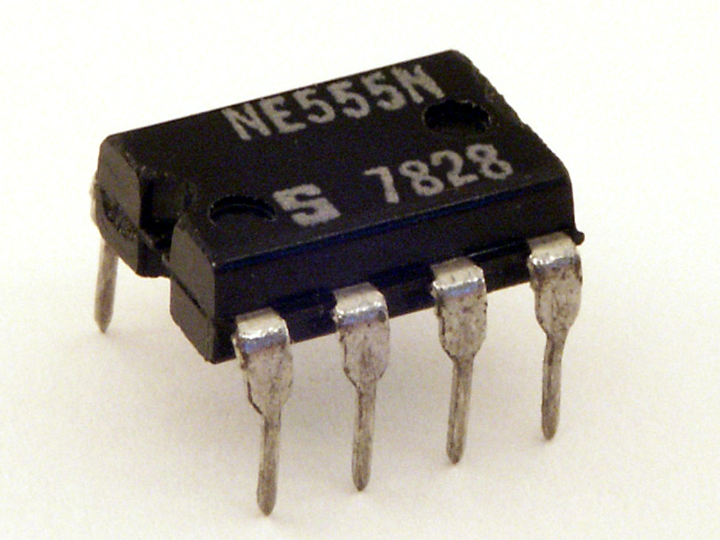

Every electrical engineer and their dog has used a **555** at some point in their education or career due to it's simplicity and versatility. So named because of the 3 5kΩ resistor used in it's internal circuitry, the **555** is capable of operating in one of three behaviours:

- **Monostable**: When the **trigger** pin changes from on to off, the **output** pin will turn on for a fixed amount of time before turning off again. Think about the backlight in some electronics, you push a button and the light turns on for a few seconds, even if you release the button

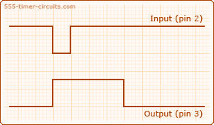

- **Bistable**: When the **trigger** pin changes from on to off, the **output** pin will turn on until the **reset** pin changes from on to off

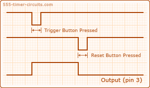

- **Astable**: The **output** pin continuously oscillates as long as the **555** is powered just like the oscillator we made with the **7400** NAND gates, but with one key advantage. Our **NAND oscillator** could only produce perfectly symmetrical oscillations, off for the same amount of time as on. With a **555**, we can manipulate the duration of the **on** and **off** periods separately, which is useful in a lot of application.
  
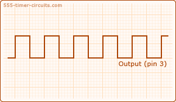

Since blinky lights are kind of a theme in this course, let's make a circuit to use the **555** in **astable mode**. Here is the **schematic** for our circuit and the **pinout** for the **555**:

Notice that the layout of the pins in the schematic **DOES NOT** match the layout in the pinout. Remember, **the schematic only tells what what needs to connect to what**, not how a circuit will look physically.

Lets work our way around the schematic, making each connection as we go. Starting at the top, we see that **reset** and **Vcc** should connect to **5V**. From the **pinout**, **reset** is pin 4 and **Vcc** is pin 8.

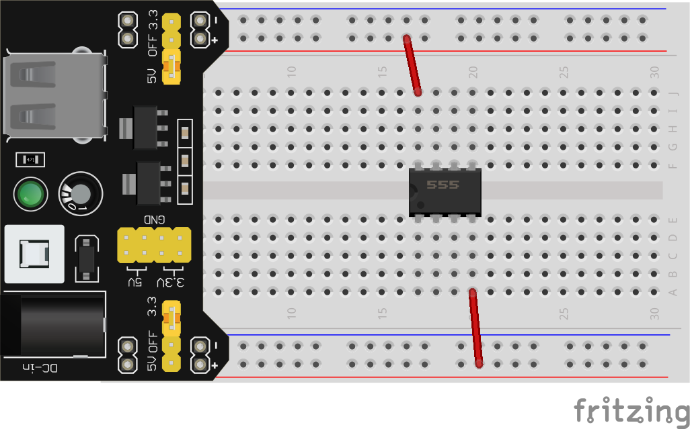

Next, **R2** needs to connect to **5V** (or either of the **reset** or **Vcc** pins) on one side, and **discharge** (pin 7) on the other side:

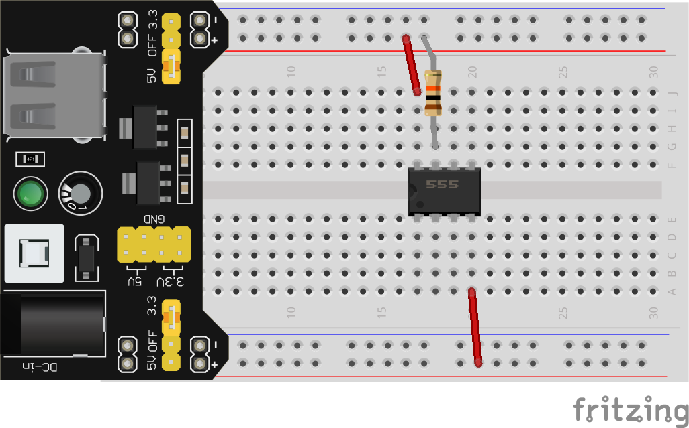

**Trigger** (pin 2) and **threshold** (pin 6) are connected together:

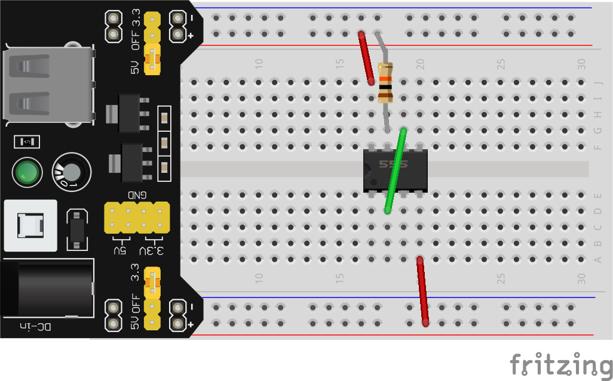

And **R1** goes between **discharge** and either **trigger** or **threshold** (since they are connected together):

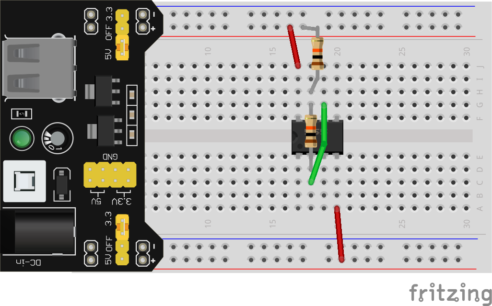

**C1** goes from **trigger** or **threshold** to **0V**:

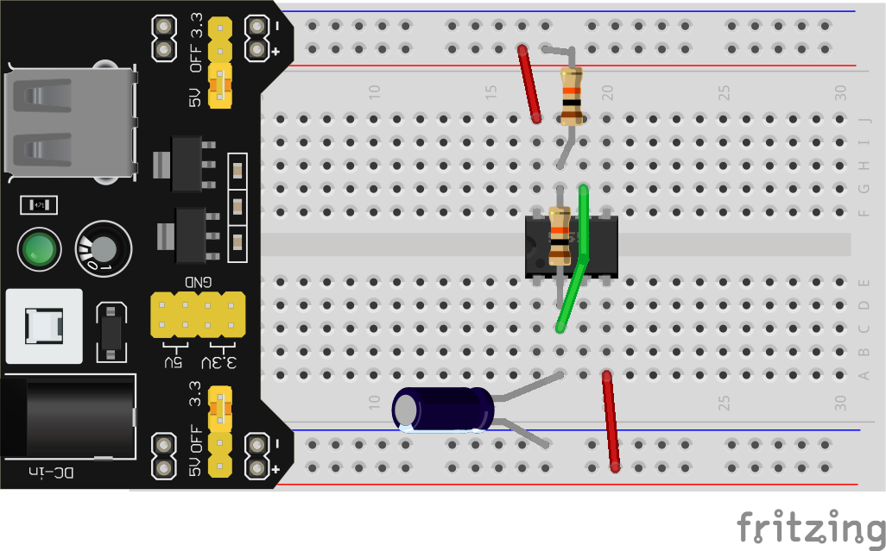

**GND** (pin 1) goes straight to **0V**:

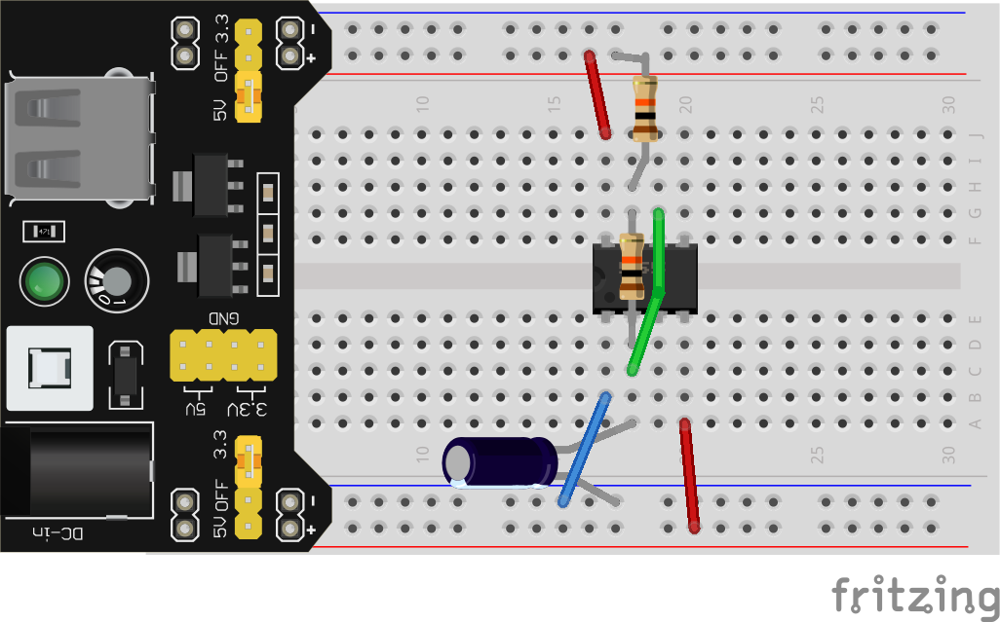

And **C2** connects **control voltage** (pin 5) to **0V**:

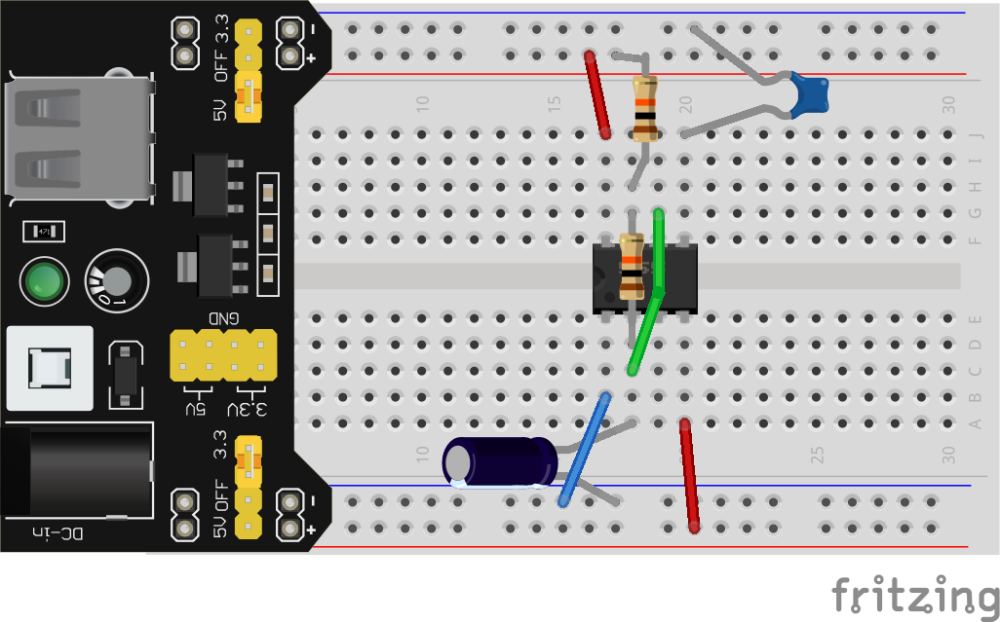

All that's left is making use of our **output** (pin 3) which we'll visualize once again with an **LED** and **220Ω resistor** combo:

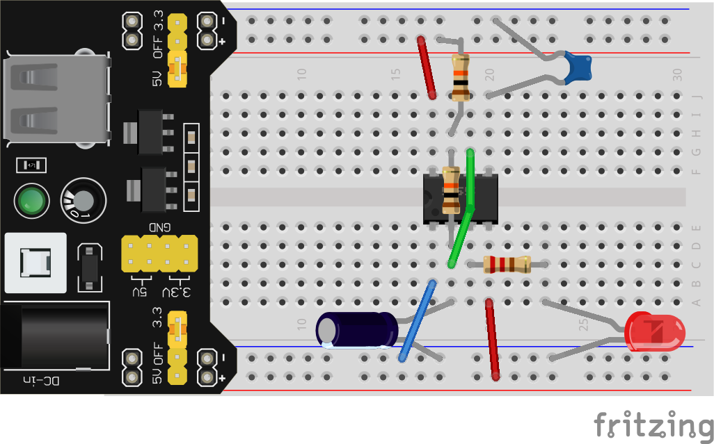

Cross your fingers, power on your breadboard, and behold once again your ability to make an LED flash on and off!

As a bonus exercise, try changing the values of **R1** and **C1** to see how they affect the oscillation.

That's all for today, next time we will go over the basic functions of the other ICs supplied in your kit and then turn your loose on making something cool!